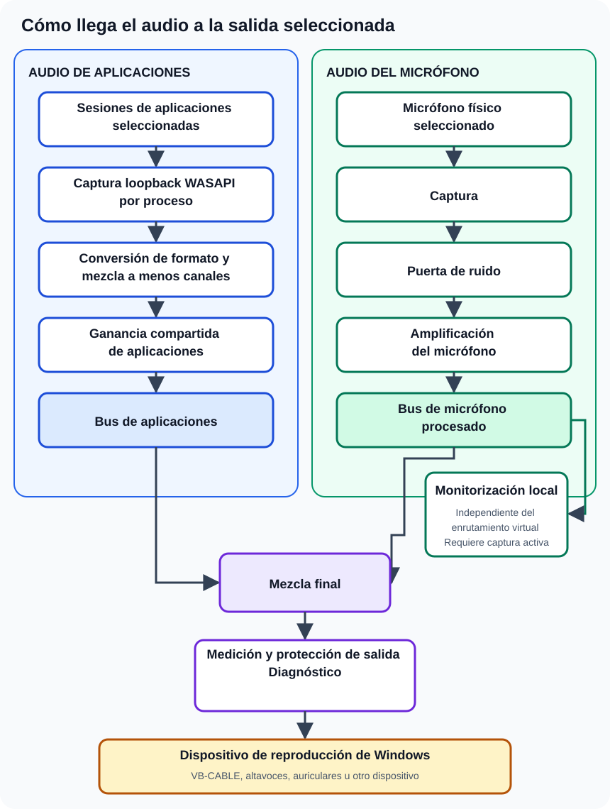

La canalización actual de Windows se organiza en tres proyectos: `IterVC.Core`, `IterVC.Audio` e `IterVC.Desktop`.

El diagrama muestra las dos entradas capturadas de forma independiente, el punto donde se unen en la mezcla final y la rama separada de monitorización local.

## Ruta de las aplicaciones

1. Se enumeran las sesiones de audio de Windows de los procesos en ejecución.
2. Se crea una sesión de captura `process-loopback` para cada proceso seleccionado.
3. Los fotogramas capturados se almacenan en búfer para procesarlos en tiempo real.
4. Se detectan los formatos de entrada y se convierten a un formato común de mezcla.
5. La entrada multicanal se normaliza o se mezcla a menos canales cuando es necesario.
6. Los flujos de las aplicaciones seleccionadas se combinan y se escalan con la ganancia compartida de aplicaciones.

## Ruta del micrófono

1. El micrófono físico seleccionado se captura de forma independiente.
2. La medición de nivel observa la señal.
3. La puerta de ruido opcional aplica el comportamiento de umbral, ataque y liberación.
4. Se aplica la amplificación del micrófono.
5. La señal procesada puede monitorizarse localmente o añadirse a la mezcla enrutada, o ambas cosas.

## Salida final

Los buses de aplicaciones y micrófono se mezclan, se miden, pasan por etapas de protección de salida y diagnóstico, y se reproducen en el dispositivo de salida de Windows seleccionado, que puede ser un cable virtual, altavoces, auriculares u otro dispositivo compatible.

## Latencia y diagnósticos

La capa de audio incluye una política de latencia, búferes en tiempo real, seguimiento de faltas y desbordamientos de búfer, mediciones de tiempo de procesamiento, diagnósticos previos a la protección, medidores de nivel y registros rotativos. Estos mecanismos ayudan a mantener estable el flujo y aportan evidencia cuando un dispositivo o una carga de trabajo no puede mantener la entrega en tiempo real.

## Límite de plataforma

La implementación de bucle invertido por proceso se basa en WASAPI de Windows y en interoperabilidad nativa introducida en Windows 10 compilación 19041. La interfaz usa Avalonia, pero el motor de audio actual sigue siendo específico de Windows.
