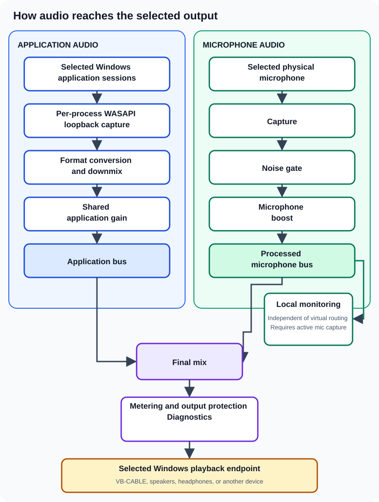

The current Windows pipeline is organized around three projects: `IterVC.Core`, `IterVC.Audio`, and `IterVC.Desktop`.

The diagram shows the two independently captured inputs, where they join the final mix, and the separate local-monitoring branch.

## Application path

1. Windows audio sessions are enumerated for running processes.
2. A process-loopback capture session is created for each selected process.
3. Captured frames are buffered for real-time processing.
4. Input formats are detected and converted to a common mix format.
5. Multichannel input is normalized or downmixed as required.
6. Selected application streams are combined and scaled by shared application gain.

## Microphone path

1. The selected physical microphone is captured independently.
2. Level metering observes the signal.
3. The optional noise gate applies threshold, attack, and release behavior.
4. Microphone boost is applied.
5. The processed signal can be monitored locally and/or added to the routed mix.

## Final output

The application and microphone buses are mixed, measured, passed through output-protection and diagnostic stages, and rendered to the selected Windows playback endpoint, which may be a virtual cable, speakers, headphones, or another compatible device.

## Latency and diagnostics

The audio layer contains a latency policy, real-time buffers, underrun/overrun tracking, processing-time measurements, pre-protection diagnostics, level meters, and rolling logs. These mechanisms help keep the stream stable and provide evidence when a device or workload cannot maintain real-time delivery.

## Platform boundary

The per-process loopback implementation relies on Windows WASAPI and native interop introduced in Windows 10 build 19041. The UI is Avalonia, but the current audio engine remains Windows-specific.
